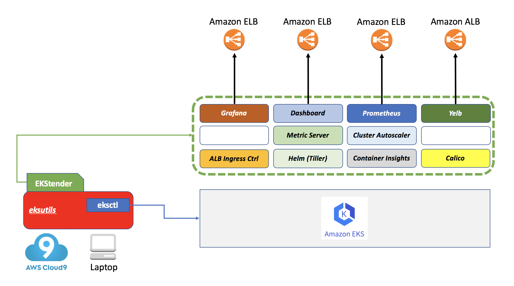

#### What is it?

`EKStender` is a tool that extends a vanilla Amazon EKS cluster with a number of add-on OSS projects.

#### What problem does EKStender solve?

The tool is aimed at bridging the gap that exists between a vanilla K8s deployment (too basic for some operational requirements) and very opinionated platforms built on top of K8s (too opinionated for many use cases).

`EKStender` is not intended to be a production tool nor a product per se. It is more of a prototype (or EKSperiment?) that intercept the needs of developers and IT of building something that sits in between a CaaS and a PaaS (for lack of better terminology). 

Without `EKStender` users of EKS would need to deploy manually the add-on components they need. `EKStender` automates those tasks by enabling said tools. See below for a list of these add-ons.  

#### What's the status of EKStender?

In its current shape and form EKStender is a useful tool to demonstrate the vast Kubernetes ecosystem. It should only be considered a basis for something that could be picked up by (and embedded into) more structured utilities, some of which are already shipping with [eksutils](https://github.com/mreferre/eksutils). Such as, for example, [eksctl](https://github.com/weaveworks/eksctl). 

The bash code included in `ekstender.sh` is no magic and comes from multiple sources. A good source has proven to be the [eksworkshop](https://eksworkshop.com/). Other sources have been the official EKS documentation as well as how-to guides of the various OSS projects. The largest amount of time has been spent on building the deployment flow. 

Note: while `EKStender` may come handy for quick tests, demos and learning sessions, some of the default choices in the deployment flow do not follow standard best practices (e.g. exposing the Kubernetes Dashboard or Prometheus via an external load balancer). Do not do this in a production setup! 

The largest part of `EKStender` would/should work with a regular upstream K8s setup but this was only tested with Amazon EKS (and in particular with setups done with [eksctl](https://github.com/weaveworks/eksctl)). Especially in the latest evolutions the dependencies of `EKStender` on environments created with `eksctl` have increased. The user experience when EKStending a cluster created with `eksctl` has improved and it requires less configurations. 

#### What stack does EKStender deploy?

This is a list of modules, features and configurations that `EKStender` enables on a vanilla EKS cluster (deployed with eksctl):

-  CloudWatch Container Insights
-  Helm tiller service
-  Kubernetes Dashboard (by default it is exposed through a public Load Balancer, but you can opt out)
-  ALB Ingress controller 
-  Calico network policy engine  
-  Prometheus (by default it is exposed through a public Load Balancer, but you can opt out)
-  Grafana (exposed through a Load Balancer)
-  Metric Server (to allow for Horizontal Autoscaler to work)
-  Cluster Autoscaler 
-  App Mesh  
-  The [yelb](https://github.com/mreferre/yelb) demo application (exposed through the ALB Ingress Controller)
-  Kubeflow 

In addition to the above, a multi-purpose `eks-admin` Service Account is created: it can be used to login into the Dashboard via grabbing its token. 

The following picture shows a graphical representation of the outcome of running `EKStender`



#### What other modules and tools are under consideration?

Other modules and tools that are under considerations to be added and enabled are:

- AWS Service Operator for Kubernetes
- Istio
- Kiali (https://aws.amazon.com/blogs/opensource/observe-service-mesh-kiali/)
- X-Ray
- efs-provisioner 
- spekt8 (https://github.com/spekt8/spekt8) 
- Spinnaker
- JenkinsX

Any feedback is greatly appreciated.

#### Getting started

Given the setup script doesn't have much error handling, requires a lot of different utilities to work and assumes that a cluster exists and that kubectl can talk to it without further configurations (e.g. no need to specify the `--kubeconfig` option), it is suggested that people that want to start experimenting with EKStender follows the following prescriptive flow. 

Start a shell with [eksutils](https://github.com/mreferre/eksutils) (a utility that embedds all the required system tools that the script assumes are available). The syntax below starts a shell importing into the container the local AWS CLI and Kubernetes environments so they persist if you need to restart the container. If you want to create an ephemeral environment remove the two `-v` mappings: 

```
docker run -it --rm -v $HOME/.aws:/root/.aws -v $HOME/.kube:/root/.kube mreferre/eksutils:latest
```

Note that if you are deploying ALL of the `EKStender` components (the default) you need quite some cluster. We will create an ASG to accomodate all needs. From within the container shell, create a brand new cluster with `eksctl`. You can pick any cluster name. 

```
eksctl create cluster --name=eks1 --nodes=3 --nodes-min=2 --nodes-max=6 --ssh-public-key=<key name> --region=<region> --asg-access
```

Note that if you have access to multiple kubernetes cluster from the environment you are working on you need to make sure this cluster above is the default one (i.e. kubectl will point to it by default).

Clone the EKStender project:

```
git clone https://github.com/mreferre/ekstender
```

Move inside the `ekstender` directory.

From here you can run `./ekstender.sh <cluster name>`. This cluster name is the name you have used with the eksctl command. This will run with default configurations that will be displayed by the script for a final check.  

These defaults are positioned at the beginning of the script but a convenient alternative to edit the script is to set the following variables in the shell before launching the script. It  will check if the variables exist and, if they do, it won't try to set them again. This is an example of how you would set those variables inside the eksutils container shell (the below example represents the current defaults):

```
export MINNODES=2
export MAXNODES=6
export EXTERNALDASHBOARD=yes 
export EXTERNALPROMETHEUS=yes 
export DEMOAPP=yes 
export KUBEFLOW=no 
export NAMESPACE="kube-system"
export MESH_NAME="ekstender-mesh"
```

EKStender will default to the region configured with the AWS CLI. If for some reasons you need to change it (because you created the cluster in a different region) you can force it by exporting a `REGION` variable before starting the script.

The script no longer requires setting the variables `CLUSTERNAME`, `AUTOSCALINGGROUPNAME` and `NODE_INSTANCE_ROLE`. The cluster name is read as the input parameter when you launch the script. The other two values will be programmatically extracted by querying `EKSCTL` and `Cloudformation`. Clusters with multiple nodegroups are not supported at the moment.

Once this is done, you can run `./ekstender.sh <cluster name>` from the `eksutil` shell. Review the info the script is going to run with and hit <enter> to proceed.

`EKStender` should work from other shells (provided you have all the tools configured e.g. kubectl, AWS CLI, jq, helm, ksonnet etc. etc.). Note that `EKStender` logs by default to a file called `ekstender.log` in the directory where you launch it. If you use it from within `eksutil` note that the file will not persist when you exit the container (you can easily fix it by mounting a directory and log there instead).

A good by-product of using kubectl to deploy these add-ons is that it makes the script idempotent by nature. You can run it multiple times against the same cluster. Since some of the tools use Helm (which is deployed by `EKStender` early in the flow) or nested scripts for their own setup, it required a bit of if-then-else logic to make the script fully idempotent. 

This is an example of a typical setup 

```
sh-4.2# ./ekstender.sh eks1
 2019-09-13 13:39:16 -- ************************************************* 
 2019-09-13 13:39:16 -- ***  Do not run this on a production cluster  *** 
 2019-09-13 13:39:16 -- *** This is solely for demo/learning purposes *** 
 2019-09-13 13:39:16 -- ************************************************* 
 2019-09-13 13:39:16 -- You are about to EKStend your EKS cluster 
 2019-09-13 13:39:16 -- These are the environment settings that are going to be used: 
 2019-09-13 13:39:16 -- Cluster Name          : eks1 
 2019-09-13 13:39:16 -- AWS Region            : us-west-2 
 2019-09-13 13:39:16 -- Node Instance Role    : eksctl-eks1-nodegroup-ng-9a16907b-NodeInstanceRole-1AS92OJAG6GPG
 2019-09-13 13:39:16 -- Kubernetes Namespace  : kube-system 
 2019-09-13 13:39:16 -- ASG Name              : eksctl-eks1-nodegroup-ng-9a16907b-NodeGroup-173MMIPFJ79XK
 2019-09-13 13:39:16 -- Min Number of Nodes   : 2 
 2019-09-13 13:39:16 -- Max Number of Nodes   : 6 
 2019-09-13 13:39:16 -- External Dashboard    : yes 
 2019-09-13 13:39:16 -- External Prometheus   : yes 
 2019-09-13 13:39:16 -- Mesh Name             : ekstender-mesh 
 2019-09-13 13:39:16 -- Demo application      : yes 
 2019-09-13 13:39:16 -- Kubeflow              : yes 
 2019-09-13 13:39:16 -- Press [Enter] to continue or CTRL-C to abort... 
 
 2019-09-13 13:39:20 -- Namespace exists. Skipping... 
 2019-09-13 13:39:20 -- Creation of the generic eks-admin service account is starting... 
 2019-09-13 13:39:21 -- Creation of the generic eks-admin service account has completed... 
 2019-09-13 13:39:21 -- Calico setup is starting... 
 2019-09-13 13:39:21 -- Waiting for Calico pods to come up... 
 2019-09-13 13:39:31 -- Calico has been installed properly! 
 2019-09-13 13:39:31 -- Helm setup is starting... 
 2019-09-13 13:39:33 -- Waiting for the tiller pod to come up... 
 2019-09-13 13:39:48 -- Tiller has been installed properly! 
 2019-09-13 13:39:48 -- Metric server deployment is starting... 
 2019-09-13 13:39:50 -- Metric server has been installed properly! 
 2019-09-13 13:39:50 -- Dashboard setup is starting... 
 2019-09-13 13:39:52 -- Warning: I am exposing the Kubernetes dashboard to the Internet... 
 2019-09-13 13:39:52 -- Dashboard has been installed properly! 
 2019-09-13 13:39:52 -- ALB Ingress controller setup is starting... 
 2019-09-13 13:40:09 -- ALB Ingress controller has been installed properly! 
 2019-09-13 13:40:09 -- Prometheus setup is starting... 
 2019-09-13 13:40:11 -- Prometheus is being exposed to the Internet...... 
 2019-09-13 13:40:11 -- Prometheus has been installed properly! 
 2019-09-13 13:40:11 -- Grafana setup is starting... 
 2019-09-13 13:40:14 -- Grafana has been installed properly! 
 2019-09-13 13:40:14 -- CloudWatch Containers Insights setup is starting... 
 2019-09-13 13:40:18 -- CloudWatch Containers Insights has been installed properly! 
 2019-09-13 13:40:18 -- Cluster Autoscaler deployment is starting... 
 2019-09-13 13:40:19 -- Cluster Autoscaler has been installed properly! 
 2019-09-13 13:40:19 -- Appmesh components setup is starting... 
 2019-09-13 13:40:34 -- Appmesh components have been installed properly 
 2019-09-13 13:40:34 -- Demo application setup is starting... 
 2019-09-13 13:42:35 -- Demo application has been installed properly! 
 2019-09-13 13:42:35 -- Kubeflow setup is starting... 
 2019-09-13 13:45:22 -- Kubeflow has been installed properly! 
 2019-09-13 13:45:22 -- Almost there... 
 2019-09-13 13:46:03 -- Congratulations! You made it! 
 2019-09-13 13:46:03 -- Your EKStended kubernetes environment is ready to be used 
 2019-09-13 13:46:03 -- ------ 
 2019-09-13 13:46:03 -- Grafana UI           : http://a03b6ee5fd62c11e9bdfd067eea79c3b-534376637.us-west-2.elb.amazonaws.com 
 2019-09-13 13:46:03 -- Prometheus UI        : http://a022e2c58d62c11e9bdfd067eea79c3b-1184130494.us-west-2.elb.amazonaws.com 
 2019-09-13 13:46:03 -- Kubernetes Dashboard : https://af7088762d62b11e9a77b0ea9c3f9cb7-1239877256.us-west-2.elb.amazonaws.com:8443 
 2019-09-13 13:46:03 -- Demo application     : http://a5fb8759-kubesystem-yelbui-bbd8-1694418741.us-west-2.elb.amazonaws.com 
 2019-09-13 13:46:03 -- Kubeflow             : http://null 
 2019-09-13 13:46:03 -- ------ 
 2019-09-13 13:46:03 -- Note that it may take several minutes for these end-points to be fully operational 
 2019-09-13 13:46:03 -- If you see a <null> or no value you specifically opted out for that particular feature or the LB isn't ready yet (check with kubectl) 
 2019-09-13 13:46:03 -- Enjoy! 
sh-4.2# 
```

#### Clean up 

The repo includes an experimental `cleanup_ekstender.sh <cluster name>` script that is intended to roll-back the setup of the `EKStender` components. Never run this cleanup script (nor `./ekstender.sh` for that matter) on a production cluster. The clean up script is primarely used to get back to a status which will allow to remove the cluster (using `eksctl delete cluster --name <clustername>`)

From within the ekstender directory run:

```
./cleanup_ekstender.sh <cluster name>
```

If you want to remove the cluster, you should now be able to run:

```
eksctl delete cluster --name eks1
```

#### Known issues and limitations

There are just too many to list all of them. Some notable limitations are:

- The Kiali container, as part of the Kubeflow deployment, consistently fail to come up with a "CreateContainerConfigError". This requires further investigation 
- Sometimes some of the components (e.g. Yelb demo app or the Kubeflow Istio) fail to register properly with the ALB. If this happens re-running `ekstender.sh` may do nothing to fix it. You can either selectively delete / apply using standalone commands or try to clean up and re-deploy via `ekstender.sh`. A `sleep 120` betwween the deployment of the Demo app and Kubeflow has been introduced that seems to mitigate this race condition but a better solution needs to be investigated
- The ALB may take some time to stabilize and being properly queried. If they are not ready when they are queried to report the endpoint (for the demo app and Kubeflow for example) a null value is displayed. The script has a number of waits to mitigate this but a better implementation would be to create a loop to check untile the end-point is ready.  
- Sometimes, when deleting the cluster (using `eksctl delete cluster`), CloudFormation complains that there are still VPC dependencies left. Deleting manually the VPC usually fixes these problems and will allow CloudFormation to tear down the EKS stack. 
- While the original intent was to deploy everything into a single namespace for consistency, this has proven to be challenging. Hence the script will evolve removing all the logic that forces the use of a specific namespace and will just deploy the Kubernetes add-on modules to the namespaces where they are intended to be deployed. This is WIP but that is the direction. 
- The `cleanup_ekstender.sh` script may leave some zombie LBs behind. When commands are ran individually the cleanup is smooth but when the same commands are ran as part of the script the outcome is not always consistent. Check out for zombie LBs after running the clean up
- The file `ekstender.sh` has evolved and no longer needs to be manually configured with the name of the cluster, the instance role name, the autoscaling group name and the region for it to work properly. These info are now extracted programmatically
- Because some of the tools and projects require additional IAM policies to be attached to the nodes, `EKStender` adds those policies to the IAM roles identified by the `NODE_INSTANCE_ROLE`. The script only supports one role and hence one `eksctl` nodegroup. If you have more than one nodegroup you could try to add those policies manually to the other roles
- The default of the script is to optimize for usability and not for security. For example by default the Kubeflow, Prometheus and K8s Dashboard interfaces are exposed publicly. You can make Prometheus and the Dashboard private but if you opt to setup Kubeflow (you can opt out) the UI can only be public for now 
- Perhaps it would make more sense to be able to selectively deploy what a user needs Vs. deploying everything regardless. This could be achieved by either creating an interactive setup (e.g. "chose what you want to deploy from this list") or by setting environmental variables inside the script in the user inputs section (e.g. what has already been done with `export DASHBOARD=yes` or `export KUBEFLOW=yes`)

